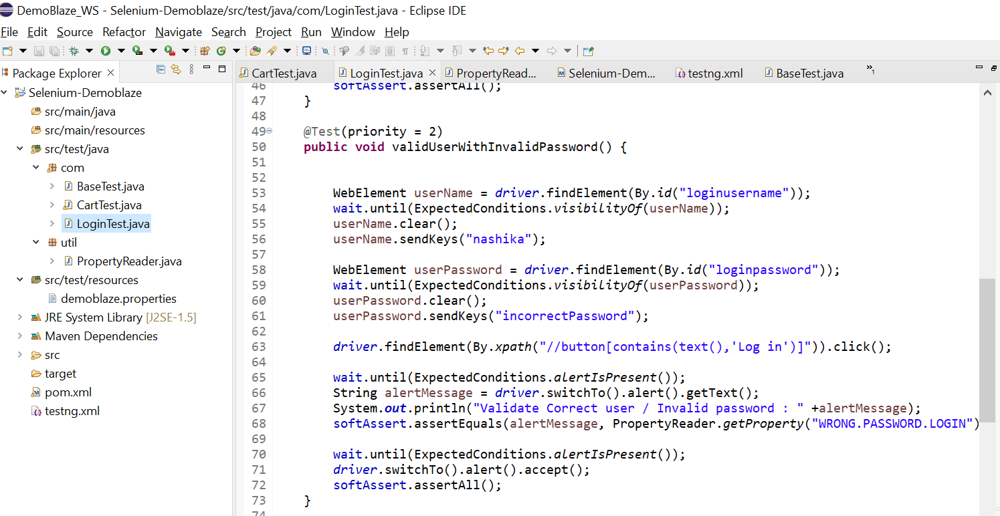
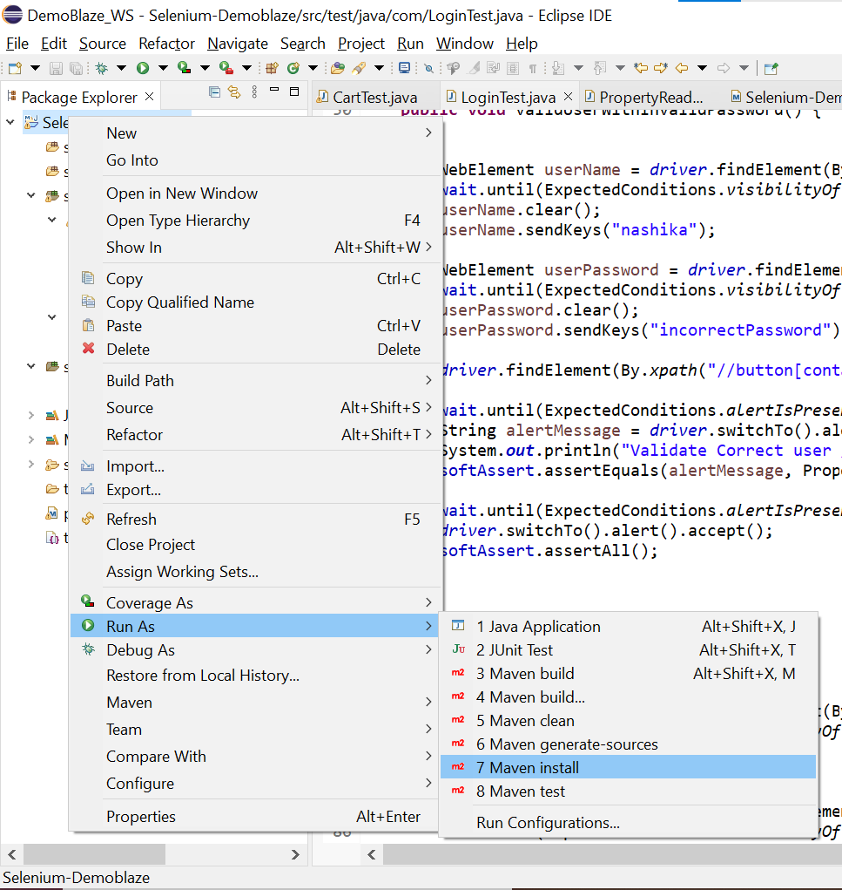

# README Guide for Selenium_Automation_Project
>Developed by Nashika Sivakumar

**DESCRIPTION**
This project is used to automate certain tasks using selenium web driver.

### Installation

1. Download eclipse / Intelligi and install it in your computer. Make sure Java,Maven are installed. 
2. Download the Selenium_Demoblaze directory from this repository.
3. Import the project into your eclipse as Maven Project.
4. The project structure should look like below


5. Click Project -> Build -> Clean to make sure there are no problems in the setup.




6. Right Click project -> Run as -> Maven Clean
7. Right Click project -> Run as -> Maven install
8. Chrome browser should automatically open up and it would perform sequence of automated tasks.
9. Once the test suite is completed, the console logs on eclipse would show the execution status.

Logs for Test Suite
````
INFO: Detected dialect: OSS
Validate Empty Message: Please fill out Username and Password.
Validate Correct user / Invalid password : Wrong password.
Validate InCorrect user : User does not exist.
Validate Boolean welcomeUser: true
selectedPhone: Samsung galaxy s6
currentItemsAfterDelete: 0
original delete list: [[[ChromeDriver: chrome on XP (37ed0a7cefe3cb5ff233f3fcaf33ec48)] -> link text: Delete]]
Delete Cart Items Passed
PASSED: blankFieldsLogin
PASSED: validUserWithInvalidPassword
PASSED: invalidUsername
PASSED: validLogin
PASSED: addToCart
PASSED: cartDelete

===============================================
    DemoBlazeTestSuite
    Tests run: 6, Failures: 0, Skips: 0
===============================================

[TestNG] Time taken by org.testng.reporters.XMLReporter@17baae6e: 15 ms
[TestNG] Time taken by org.testng.reporters.SuiteHTMLReporter@134593bf: 60 ms
[TestNG] Time taken by org.testng.reporters.JUnitReportReporter@4b9e255: 8 ms
[TestNG] Time taken by [FailedReporter passed=0 failed=0 skipped=0]: 0 ms
[TestNG] Time taken by org.testng.reporters.EmailableReporter@1d7acb34: 3 ms
[TestNG] Time taken by org.testng.reporters.jq.Main@1068e947: 33 ms
[INFO] Tests run: 6, Failures: 0, Errors: 0, Skipped: 0, Time elapsed: 69.216 s - in TestSuite
[INFO] 
[INFO] Results:
[INFO] 
[INFO] Tests run: 6, Failures: 0, Errors: 0, Skipped: 0
    
    
````

##PROJECT PRE-REQUISTES

Based on the operating System, download and install the following softwares

* Java 1.8 or greater (https://www.java.com/en/download/)
* Intellji (https://www.jetbrains.com/idea/download/#section=mac)
* maven 3 or greater (https://maven.apache.org/download.cgi)
* Install chrome web browser


#### Technologies Used
* Java
* Maven
* Selenium

